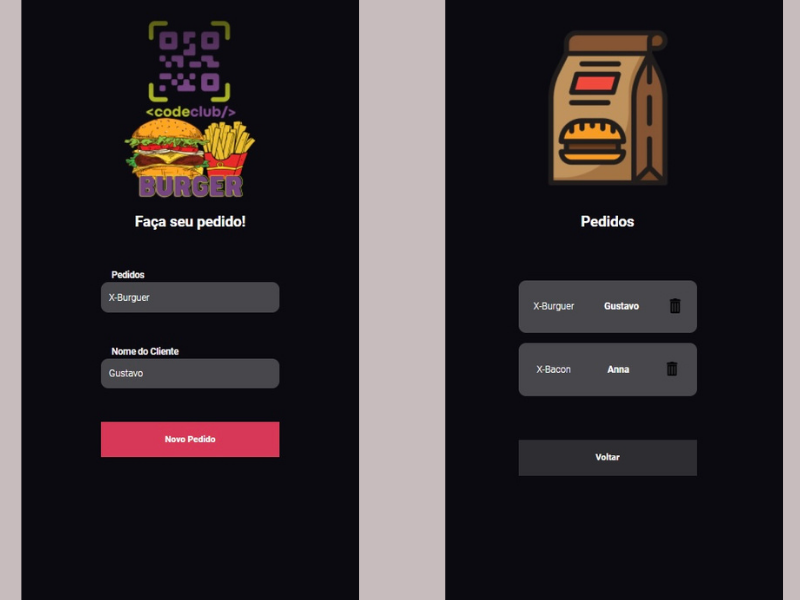

# Projeto Hamburgueria 

> Projeto pessoal desenvolvido com o objetivo de aprimorar habilidades com HTML, CSS e JS.

### Criação do Projeto

Durante desenvolvimento do projeto foram utilizadas tanto tecnologias para Front End (React e JavaScript) como tecnologias de Back End (Node):

- [x] Conectividade do Front End com o Back End
- [x] Conectividade do Back End com o Insomnia 
- [x] Possibilidade de navegação entre paginas

